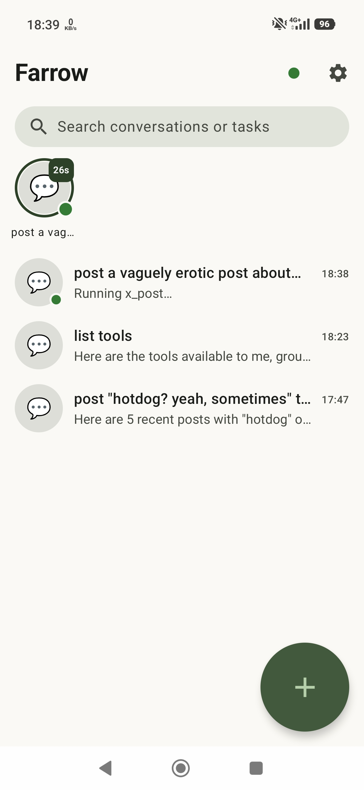
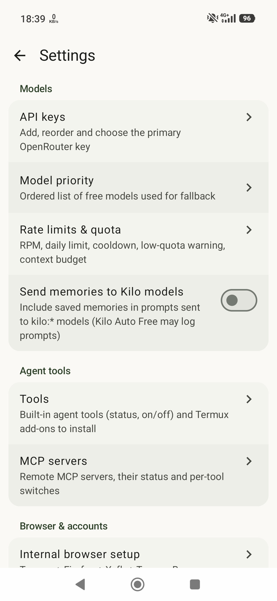

# Farrow

**An on-device AI agent for Android that actually does things:** it browses with a real Firefox (via Termux), runs shell commands through Shizuku, drives apps with Accessibility, and works with Git, all on **free OpenRouter / Kilo models** with automatic model and key fallback and rate-limit recovery. No server and no cloud backend: your keys stay encrypted on your phone.

<p align="center">
  
  &nbsp;&nbsp;
  
</p>

## Features

- **Messenger-style chat UI** (Kotlin, Jetpack Compose, Material 3) with chat heads / Android Bubbles and a quota indicator.
- **Free-model agent loop:** tool calling on OpenRouter free models and Kilo, priority list, automatic fallback across models and API keys, backoff and auto-resume after rate limits.
- **Real browser automation:** Firefox in Termux through [Termux Browser Pilot](https://github.com/salviz/termux-browser-pilot) (`tbp`) and a token-protected local bridge (`127.0.0.1:8765`): `web_scrape`, `web_click`, `web_type`, `web_session`, `web_screenshot` (viewport, full page or element; images go to vision models). Falls back to HTTP + Jsoup when the bridge is down.
- **Human-like input:** Bézier mouse paths and realistic typing cadence.
- **Social posting:** X.com and Facebook status/post/scrape tools driven by updatable selector files (`assets/selectors/*.json`).
- **Device control:** `run_shell` via Shizuku (shell uid), `screen_*` tools via an Accessibility service, `termux_run` in Termux.
- **Git:** clone / status / commit / push with JGit inside the app workspace.
- **Memory, MCP client, sandboxed file tools** and a keep-alive service that only runs while a task runs.
- **Security first:** API keys in EncryptedSharedPreferences (Android Keystore), no backups, bridge requests require a token.

## Quick start

### 1. Install the app

Download `Farrow-v<version>-debug.apk` from [Releases](https://github.com/chr243/Farrow/releases) and open it on the phone (Android 11+, minSdk 30), or with adb:

```bash
adb install -r Farrow-v1.0.0-debug.apk
```

Then open Farrow → **Menu → API keys** and add an OpenRouter key (`sk-or-…`) and/or a Kilo key.

### 2. Termux + Firefox bridge (optional, for web tools)

Install [Termux](https://f-droid.org/packages/com.termux/) (F-Droid build; TODO(maintainer): confirm which Termux distributions are supported). Paste this **once** into Termux so Farrow may run commands there:

```bash
mkdir -p ~/.termux && (grep -q '^allow-external-apps *= *true' ~/.termux/termux.properties 2>/dev/null || echo 'allow-external-apps = true' >> ~/.termux/termux.properties) && termux-reload-settings && echo OK
```

Grant Farrow the *Run commands in Termux* permission (Android Settings → Apps → Farrow → Permissions → Additional permissions), then use **Menu → Internal browser setup → Run in Termux** for each step. The steps do the equivalent of:

```bash
pkg update && pkg install -y x11-repo tur-repo
pkg update && pkg install -y git python firefox xorg-server-xvfb xdotool xclip openbox ca-certificates
git clone https://github.com/salviz/termux-browser-pilot ~/termux-browser-pilot
bash ~/termux-browser-pilot/setup.sh        # provides the `tbp` CLI
# steps 4–5 (in-app only): write ~/.farrow/tbp_bridge.py + token and start the bridge on 127.0.0.1:8765
```

### 3. Shizuku (optional, for `run_shell`)

Install [Shizuku](https://shizuku.rikka.app/), open it and start it via **Wireless debugging** (Developer options → Wireless debugging → pair from the Shizuku app), or from a computer:

```bash
adb shell sh /storage/emulated/0/Android/data/moe.shizuku.privileged.api/start.sh
```

Then open Farrow → **Menu → Shizuku, accessibility & Git** and grant the Shizuku permission; **Test (id)** should report `uid=2000(shell)`.

### 4. Build from source

Requires JDK 17 and an Android SDK with `platforms;android-35` and `build-tools;35.0.0`.

```bash
git clone https://github.com/chr243/Farrow.git && cd Farrow
echo "sdk.dir=$ANDROID_HOME" > local.properties   # never commit this file
./gradlew assembleDebug testDebugUnitTest lint
# APK: app/build/outputs/apk/debug/Farrow-v<version>-debug.apk
```

## Documentation

- [AGENTS.md](AGENTS.md): repo map, commands and rules for AI coding agents and contributors
- [CONTRIBUTING.md](CONTRIBUTING.md): how to contribute
- [docs/ARCHITECTURE.md](docs/ARCHITECTURE.md): architecture, tools, bridge protocol and version history

## Status and limitations

Personal project, debug-signed builds only. Social-site selectors drift as those sites change; captchas and checkpoints are not automated. See [docs/ARCHITECTURE.md](docs/ARCHITECTURE.md#known-limitations).

## License

TODO(maintainer): no license file yet. Choose one (e.g. MIT / Apache-2.0) and add `LICENSE`.
